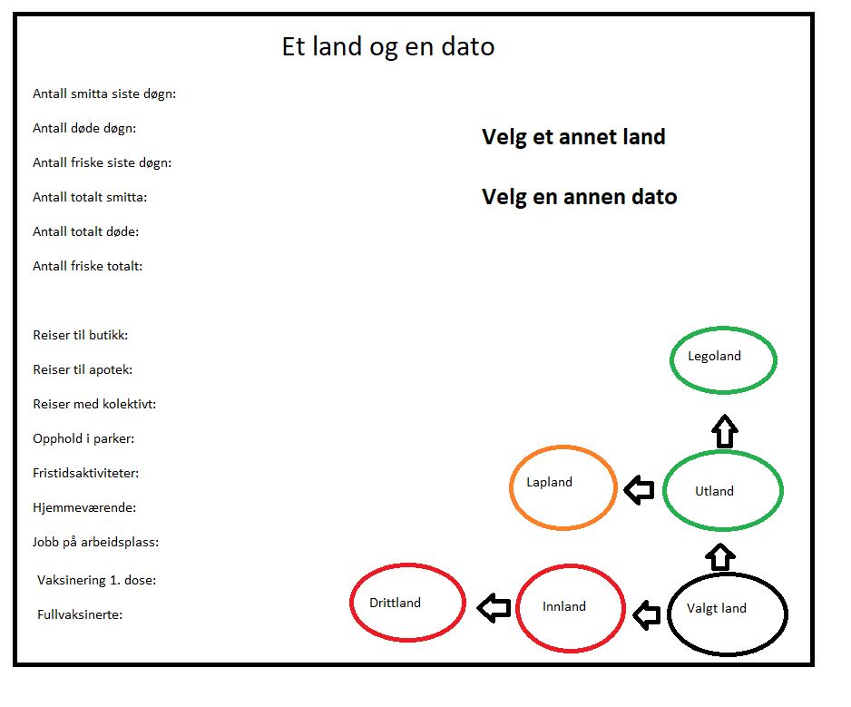
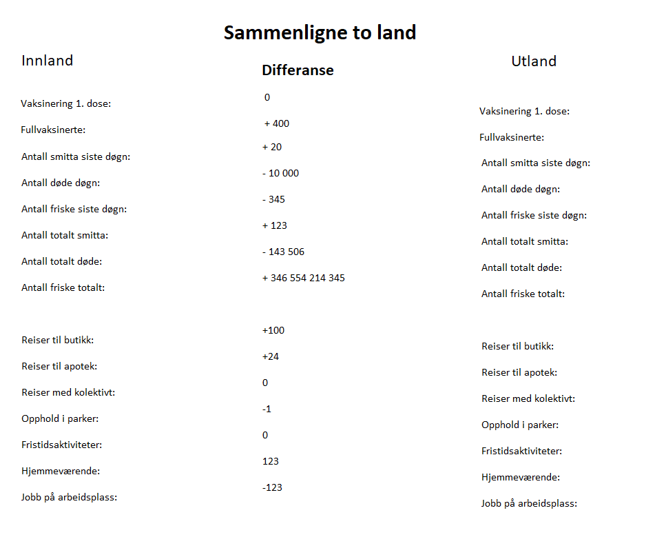

# Oblig 1

## Skisse

## Forklaring
Dette er en nettside for å finne data om corona, som smittestatus, vaksinering og bevegelsesmønster. Målet for nettsiden er å samle mest mulig data om corona, og gjøre det tilgjengelig for flest mulig brukere. Nettsiden har to 2 layout, ettersom  man har valgt et eller 2 land. Derfor er det to skisser, en for hver layout. Felles for begge layoutene er at det må velge en dato for når man ønsker verdier for. 

På skissene skulle det vært flere oppføringer for vaksinering, som tall for den valgte datoen. Det er derimot ikke med i skissene ettersom det da blir veldig trangt på skissene. Tanken er at de vises på samme måte som antall smittede, døde og så videre.

### Et land
Den første skissen er for når kun et land er valgt. Nettsiden skal da hente data for landet for rett dato. Det skal igjen vises ved de ulike feltene på venstre siden av nettsiden. På øvre høyre del av nettsiden er det mulighet for å velge en annen dato for å få andre tall på feltene. Det andre feltet er for å legge til et annet land, for å komme til skisse nummer 2.

Nederst på høyre er det en oversikt over flyreiser fra landet som er valgt. Pilene viser mellom hvilke land et fly har flydd. Fargen på sirklene viser smittestatus på landet sammenlignet med det valgte landet. Altså de grønne er land som har mindre smitte enn det valgte landet, oransje har ca like mye smitte mens de røde har mer smitte.

## Valg av datasett
I denne oppgava er det 4 datasett som brukes. To av dem handler direkte om corona, smittestatus og vaksinering. Disse er hentet fra kaggle.com. Det tredje datasettet som brukes er om bevegelsesmønster som google har produsert. Alle disse datasetta oppdateres fortsatt i skrivende stund, der data blir lagt på i slutten av filene. Det siste datasettet handler om flyreiser.

### Beskrivelse av google activety
https://www.google.com/covid19/mobility/

Datasettet inneholder informasjon om hvordan og hvor folk beveger seg, for eksempel til butikker og appotek. Datasettet består av 270 filer, altså en fil per land, eller en fil med alle dataene. Dette datasettet har en del subregioner, tilsvarende fylker og kommuner her i Norge, og inneholder dermed mye mer data enn de andre datasetta. Disse subregionene brukes derimot ikke, så kunne like gjerne vært fjernet.

Hver rad er en egen oppføring for et område på en dato. I tillegg er det en del felt for å skille subregioner fra hverandre, så totalt 10 felt går med på å skille oppføringene.

Deretter kommer de interessante delene i datasettet, nemmelig tallene for hvor folk reiser. Her er det 6 felt som viser endringer i prosent for hvor folk er. Som regel vil de fleste tallene være negative siden folk er mindre på butikker og slikt sammenlignet med før, mens feltet for hvor mange som er hjemme vil være positivt.

For dette datasettet har jeg valgt å bruke dokumentdatabase. Databasen skal for nettsiden sin del bare holde på data, og det vil ikke være noe behov for å gjøre noe spesielt med dataen.

Eventuelt kunne man lagt til muligheten til å kunne finne største og minste verdier blant tallene, men det krever igjen at man indekserer dokumentene på de aktuelle feltene. Det vil også kreve mye mer lagringsplass, og ettersom jeg ser for meg at det er funksjonalitet som brukes lite vil det være lite lønnsomt å ta med.

### Beskrivelse av vaksine datasett
https://www.kaggle.com/gpreda/covid-world-vaccination-progress

Vakisnedatasettet består av en fil, med en rad per land og dato. I settet er det 222 land, med datoer fra 1 desember. Settet blir fortsatt oppdatert, så man kan få nye oppføringer dersom man ønsker det.

Settet startet med land og landkode. Deretter kommer datoen for oppføringen, som sammen med land gjør hver rad unik fra de andre. Deretter kommer tall for vaksinasjoner. Først totalen vaksiner og fullvaksinert, så daglige vaksinasjoner og deretter prosent. I starten for hvert land vil det da være en del null verdier, siden vaksinering ikke startet samtidig i alle land.

Til dette datasettet skal det brukes en kolonnefamilie database. Datasettet skal ha en sammensatt nøkkel bestående av navnet på landet gjelder for, og datoen. Det sikrer i tillegg til at hvert land bare kan ha en en oppføring per dato.

### Beskrivelse av smitte datasett
https://www.kaggle.com/imdevskp/corona-virus-report?select=full_grouped.csv

Datagrunnlaget er en fil med egne rader per land per dato. I hver rad er det i tillegg data for oppføringen, altså smittede, døde og friske. I tillegg har hver oppføring en summering av de tidligere oppføringene for landet.

I datasettet er det noen feil, altså at det er noen verdier som er negative. Dette kommer av måten data er samlet inn. Dette kommer derimot så sjeldent at det blir ignorert.

Datasettet passer best til key-value databaser, med landet og datoen som key. Grunnen til dette er at dette er det datasettet som blir brukt mest, ettersom det skal brukes flere ganger på nettsiden for et land. Det er derfor en fordel med key-value ettersom det er en rask database å gjøre spørringer mot, og man bare skal hente data.

### Beskrivelse av flyreiser
https://zenodo.org/record/3974209#.YUBfT50zaUm

Det siste datasettet er over flyreiser internasjonalt. Settet består av en fil per måned, som tilsammen blir 3,1 GB med data. Settet har første dato 1. januar 2019, som er tidligere enn de andre datasetta. Ettersom de andre datasetta starter senere enn dette, er det en del av dette som ikke trengs.

Settet består av rader der hver rad er en flygning. En flygning består av data om flyet, som ikke er relevant i denna sammenhengen. Deretter kommer hvilken flyplass det reiste fra, og til. Deretter er det noen flere felt som handler om flyplassen, som ikke er interresant for selve flyreisen som skal brukes her.

I datasettet brukes det flyplasser, mens de andre datasetta bruker land. Derfor skal datasettet "tilpasses" ved å bytte ut flyplass navnet med navnet på landet. For å gjøre det brukes et ekstra datasett for å vite hvor hvilken flyplass ligger.

Ettersom datasettet handler om flyreiser passer det bra til en graf database. Nodene skal da være landet flyet fløy mellom, mens relasjonene blir selve flyvningen. Det er dermed relasjonene som skal ha data ettersom data for landet endres over tid.

## Koble sammen datasett
Alle datasetta har felt for dato og land. Det er disse som brukes til å koble datasetta sammen. For de tre første datasettet vil det bare være å sette sammen datasettene. Det gjør at man får samlet alt av data som hører sammen til et sted.

Datasettet om flyreiser brukes for å vise hvor man har reist fra et land, som gjør at man kan koble sammen ulike land. Det gir derfor en annen verdi en å koble sammen de andre datasetta. Datasettet kobels sammen som de andre, altså med dato og navn på landet.