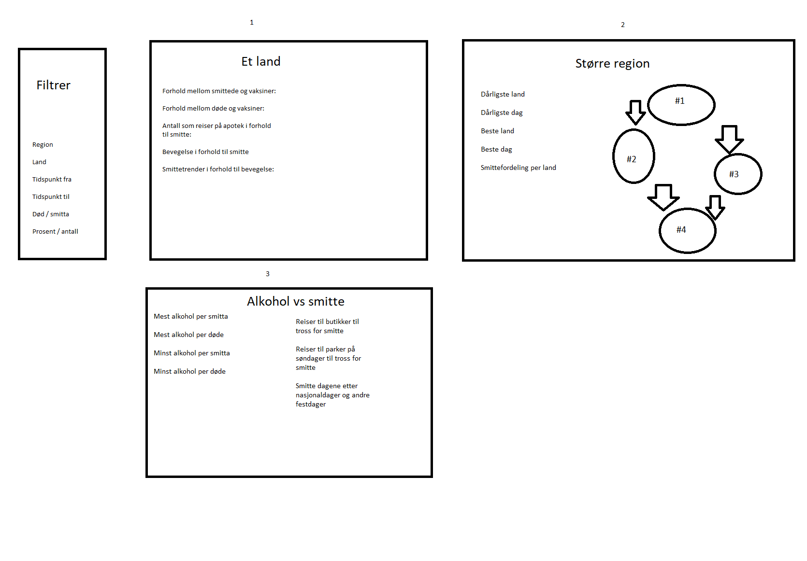

# Oblig 1

## Skisse

## Forklaring
En nettside der man kan sammenligne tall for ulike land og reginoner. En filter meny brukes til å begrense dataen man får tilbake. Avhengig av hva man velger kommer det ulikt hovedinnhold. For eksempel kommer oversikten over et land opp når man velger et land, men DERSOM man ikke spesefiserer et land blir en region brukt.

### Filter
Mulighet til å filtrere etter visse verdier. Det gjør at man da ikke trenger å bruke alt fra datasettene når det ikke er interessant. Filter vil da være med i alle tilfeller, i tillegg til en av de 3 andre seksjonene.

### Et land (#1)
Viser litt statistikk for et land, smitte og hvor mye innbyggere beveger på seg. Det kombinerer alle datasetta, og kobler datoene mot hverandre der det er datoer.

### Større region (#2)
Viser statistikk for et større område, for eksempel et kontinent. Blant annet hvilke land som først fikk smitte, og hvordan smitten KAN ha spred seg. I tillegg skal det kunne gå å sammenligne land mot hverandre for å lage statistikk.

### Alkohol vs smitte (#3)
Viser sammenhengen mellom smitte og alkoholforbruk, dersom man finner det. I tillegg vises hvordan reiser til parker og resturanter har utviklet seg, som begge er steder der folk kan finne på å drikke. 

I tillegg er det et område for smitte etter fest- og helligdager. Her i Norge kunne det for eksempel vært 17. mai, 1. mai og romjula. Dette er dager mange samles og det kan derfor gi utslag i datasettene.

## Valg av datasett
Datasettene om corona, altså smitte og vaksiner, passer bra sammen siden de har datoer og en tydelig relasjon. Google sitt datasett om hvordan befolkninger beveger seg blir mer spennende å se om kommer til å ha noen tydelig sammenheng.

I tillegg var tanken var egentlig å bruke private størmforbruk og sette det i forhold til smitte, for å få et estimat på hvor mange som hadde hjemmekontor. Dette fant jeg ikke noen datasett for, så derfor ble det alkohol per land istedenfor.